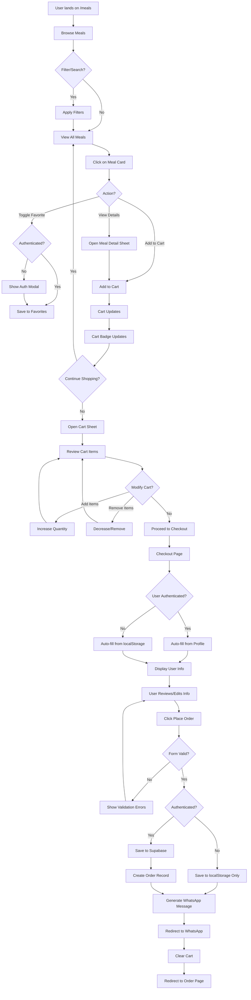

# Complete Meals to WhatsApp Order Flow Documentation

## Overview
This document describes the complete end-to-end flow from browsing meals on the `/meals` page, adding items to cart, proceeding through checkout, auto-fetching user details, and placing an order via WhatsApp.

---

## Table of Contents
1. [Architecture Overview](#architecture-overview)
2. [Tech Stack](#tech-stack)
3. [Flow Diagram](#flow-diagram)
4. [Page-by-Page Flow](#page-by-page-flow)
5. [Key Features](#key-features)
6. [Data Flow](#data-flow)
7. [Components Breakdown](#components-breakdown)
8. [State Management](#state-management)
9. [API Integration](#api-integration)
10. [Replication Guide](#replication-guide)

---

## Architecture Overview

### High-Level Flow
```
Meals Page → View/Filter Meals → Add to Cart → Cart Sheet → 
Checkout Page → Auto-fill User Data → Place Order → 
Save to Database → WhatsApp Redirect → Order Confirmation
```

### Technology Stack
- **Frontend Framework**: Next.js 14+ (App Router)
- **UI Library**: React 18+
- **Styling**: Tailwind CSS + shadcn/ui components
- **Animations**: Framer Motion
- **State Management**: React Hooks + localStorage
- **Authentication**: Supabase Auth
- **Database**: Supabase (PostgreSQL)
- **Notifications**: React Hot Toast
- **Type Safety**: TypeScript

---

## Flow Diagram



---

## Page-by-Page Flow

### 1. Meals Page (`/meals`)

**File**: `app/meals/page.tsx`, `components/MealsPage.tsx`

#### Features:
- **Meal Display**: Grid/List view toggle
- **Search**: Real-time meal search by name/description
- **Filtering**: 
  - By Category (Breakfast, Lunch, Dinner, etc.)
  - By Food Type (Veg/Non-Veg/All)
  - By Dietary Type (Keto, Vegan, etc.)
  - By Calorie Range
  - By Price Range
  - Availability toggle
- **Sorting**: 
  - Default (A-Z)
  - Price (Low to High / High to Low)
  - Calories (Low to High)
  - Protein (High to Low)
- **Favorites**: Toggle favorite meals (requires auth)
- **Cart Management**: Add meals directly from meal cards
- **Responsive**: Mobile-first design with bottom navigation

#### Key Components:
```typescript
// Main Page Component
<MealsPage>
  <MealsHeader />           // Search, Cart Icon, Filter Button
  <CategoryTabs />          // Horizontal scrollable category tabs
  <MealCard />              // Individual meal display (grid/list)
  <MealDetailSheet />       // Modal for meal details
  <CartSheet />             // Sliding cart panel
  <FilterSheet />           // Advanced filters panel
  <AuthModal />             // Sign in/up modal for favorites
</MealsPage>
```

#### State Management:
```typescript
// Core States
const [meals, setMeals] = useState<Meal[]>([])
const [cart, setCart] = useState<CartItem[]>([])
const [favorites, setFavorites] = useState<string[]>([])
const [filteredMeals, setFilteredMeals] = useState<Meal[]>([])
const [searchQuery, setSearchQuery] = useState("")
const [selectedCategory, setSelectedCategory] = useState<string | null>(null)
const [selectedFoodType, setSelectedFoodType] = useState<boolean | null>(null)
const [calorieType, setCalorieType] = useState<string>("all")
const [priceRange, setPriceRange] = useState<[number, number]>([0, 1000])
const [sortOption, setSortOption] = useState<string>("default")
const [viewMode, setViewMode] = useState<"grid" | "list">("grid")
```

#### Data Fetching:
```typescript
// Fetch from Supabase
useEffect(() => {
    async function fetchData() {
        // Fetch meals
        const { data: mealsData } = await supabase
            .from("meals")
            .select("*")
            .order("name")
        
        // Fetch categories
        const { data: categoriesData } = await supabase
            .from("meal_categories")
            .select("*")
        
        // Fetch dietary types
        const { data: dietaryTypesData } = await supabase
            .from("dietary_types")
            .select("*")
            
        setMeals(mealsData || [])
        setCategories(categoriesData || [])
        setDietaryTypes(dietaryTypesData || [])
    }
    fetchData()
}, [])
```

#### Filtering Logic:
```typescript
useEffect(() => {
    let result = meals
    
    // Filter by search query
    if (searchQuery) {
        result = result.filter(meal => 
            meal.name.toLowerCase().includes(searchQuery.toLowerCase()) ||
            meal.description?.toLowerCase().includes(searchQuery.toLowerCase())
        )
    }
    
    // Filter by category
    if (selectedCategory) {
        result = result.filter(meal => meal.category_id === selectedCategory)
    }
    
    // Filter by food type
    if (selectedFoodType !== null) {
        result = result.filter(meal => meal.food_type === selectedFoodType)
    }
    
    // Filter by dietary type
    if (selectedDietaryType) {
        result = result.filter(meal => meal.dietary_type_id === selectedDietaryType)
    }
    
    // Filter by calorie type
    if (calorieType !== "all") {
        if (calorieType === "low") result = result.filter(m => m.calories < 400)
        if (calorieType === "medium") result = result.filter(m => m.calories >= 400 && m.calories <= 600)
        if (calorieType === "high") result = result.filter(m => m.calories > 600)
    }
    
    // Filter by price range
    result = result.filter(meal => 
        meal.price >= priceRange[0] && meal.price <= priceRange[1]
    )
    
    // Filter by availability
    if (showOnlyAvailable) {
        result = result.filter(meal => meal.is_available)
    }
    
    // Apply sorting
    const sortFn = sortOptions.find(opt => opt.value === sortOption)?.sortFn
    if (sortFn) result = [...result].sort(sortFn)
    
    setFilteredMeals(result)
}, [meals, searchQuery, selectedCategory, selectedFoodType, ...])
```

---

### 2. Meal Card Component

**File**: `components/meals/MealCard.tsx`

#### Features:
- **Image Display**: Meal image with fallback gradient
- **Badges**: Veg/Non-Veg, Category, Nutritional info
- **Rating Display**: Star rating (placeholder)
- **Cooking Time**: Display preparation time
- **Price**: Prominent price display
- **Actions**:
  - View Details button
  - Add to Cart button
  - Favorite toggle (heart icon)
- **Availability**: Visual indicator for unavailable items
- **Dual Layouts**: Grid and List view support

#### Add to Cart Functionality:
```typescript
const addToCart = useCallback((meal: Meal) => {
    setCart((prevCart) => {
        const existingItemIndex = prevCart.findIndex((item) => item.id === meal.id)
        
        if (existingItemIndex >= 0) {
            const updatedCart = [...prevCart]
            updatedCart[existingItemIndex].quantity += 1
            return updatedCart
        } else {
            return [...prevCart, { ...meal, quantity: 1 }]
        }
    })
    
    toast.success(`Added ${meal.name} to cart`)
}, [])
```

---

### 3. Cart Sheet Component

**File**: `components/meals/CartSheet.tsx`

#### Features:
- **Sliding Panel**: Right-side sheet overlay
- **Cart Items List**: Display all cart items with:
  - Item image
  - Name and food type indicator
  - Quantity controls (+ / -)
  - Price per item
  - Remove button
  - Nutritional badges
- **Price Breakdown**:
  - Subtotal
  - Delivery fee (₹40)
  - Discount (₹50 off on orders above ₹500)
  - Total amount
- **Discount Indicator**: Shows how much more to add for discount
- **Empty Cart State**: Friendly message with CTA
- **Proceed to Checkout**: Button to navigate to checkout

#### Cart State Persistence:
```typescript
// Save to localStorage whenever cart changes
useEffect(() => {
    localStorage.setItem("honestMealsCart", JSON.stringify(cart))
}, [cart])

// Load from localStorage on mount
useEffect(() => {
    const savedCart = localStorage.getItem("honestMealsCart")
    if (savedCart) {
        try {
            setCart(JSON.parse(savedCart))
        } catch (e) {
            console.error("Failed to parse cart from localStorage")
        }
    }
}, [])
```

#### Quantity Management:
```typescript
// Increase quantity
const onAddToCart = (item: CartItem) => {
    setCart(prevCart => 
        prevCart.map(cartItem => 
            cartItem.id === item.id 
                ? { ...cartItem, quantity: cartItem.quantity + 1 }
                : cartItem
        )
    )
}

// Decrease quantity
const onRemoveFromCart = (itemId: string) => {
    setCart(prevCart => {
        const item = prevCart.find(i => i.id === itemId)
        if (item && item.quantity > 1) {
            return prevCart.map(cartItem =>
                cartItem.id === itemId
                    ? { ...cartItem, quantity: cartItem.quantity - 1 }
                    : cartItem
            )
        } else {
            return prevCart.filter(cartItem => cartItem.id !== itemId)
        }
    })
}

// Remove item completely
const onRemoveItemCompletely = (itemId: string) => {
    setCart(prevCart => prevCart.filter(item => item.id !== itemId))
    toast.success("Item removed from cart")
}
```

---

### 4. Meal Detail Sheet

**File**: `components/meals/MealDetailSheet.tsx`

#### Features:
- **Full-Screen Modal**: Detailed meal information
- **Image Gallery**: Swipeable images with indicators
- **Meal Information**:
  - Name, category, price
  - Rating and reviews count
  - Cooking time
  - Spice level indicator
  - Veg/Non-Veg badge
- **Tabbed Content**:
  - **Details Tab**: Description, allergens, ingredients
  - **Nutrition Tab**: Detailed macros with visual progress bars
  - **Benefits Tab**: Health benefits and meal properties
- **Actions**:
  - Favorite toggle
  - Share button (Web Share API)
  - Quantity controls
  - Add to Cart
  - Close button

---

### 5. Filter Sheet

**File**: `components/meals/FilterSheet.tsx`

#### Features:
- **Sliding Panel**: Left-side filter panel
- **Filter Options**:
  - Food Type: All, Veg, Non-Veg
  - Category: Multi-select from available categories
  - Dietary Type: Keto, Vegan, Gluten-Free, etc.
  - Calorie Range: Low, Medium, High, All
  - Price Range: Slider (₹0 - ₹1000)
  - Availability: Toggle for available items only
- **Active Filter Count**: Badge showing number of active filters
- **Clear All Filters**: Reset button
- **Apply Button**: Apply filters and close

---

### 6. Checkout Page

**File**: `app/checkout/page.tsx`

#### Features:
- **Two-Column Layout**: 
  - Left: Delivery info and payment method
  - Right: Order summary
- **Auto-fill User Details**:
  - From Supabase profile (if authenticated)
  - From localStorage (if previously entered)
- **Form Fields**:
  - Full Name
  - Phone Number
  - Delivery Address (textarea)
  - Special Instructions (optional)
- **Payment Method**: Cash on Delivery (COD) - pre-selected
- **Order Summary**:
  - All cart items with quantities
  - Subtotal
  - Delivery fee
  - Total amount
- **Delivery Information**: Estimated delivery time
- **Place Order Button**: Triggers WhatsApp order flow

#### Data Auto-fill Logic:
```typescript
useEffect(() => {
    // 1. Load cart from localStorage
    const savedCart = localStorage.getItem("honestMealsCart")
    if (savedCart) {
        setCart(JSON.parse(savedCart))
    } else {
        router.push("/meals")
        toast.error("Your cart is empty")
    }

    // 2. Load user data from localStorage (guest users)
    const userData = localStorage.getItem("honestMealsUser")
    if (userData) {
        const user = JSON.parse(userData)
        setCustomerName(user.name || "")
        setCustomerPhone(user.phone || "")
        setCustomerAddress(user.address || "")
    }

    // 3. Check authentication and load from Supabase
    async function checkAuth() {
        const { data } = await supabase.auth.getSession()
        if (data.session) {
            setIsAuthenticated(true)
            
            // Fetch profile from Supabase
            const { data: profile } = await supabase
                .from("profiles")
                .select("*")
                .eq("id", data.session.user.id)
                .single()
            
            if (profile) {
                // Supabase data takes precedence
                setCustomerName(profile.full_name || "")
                setCustomerPhone(profile.phone_number || "")
                setCustomerAddress(profile.address || "")
            }
        }
    }
    checkAuth()
}, [router, supabase])
```

---

### 7. WhatsApp Order Flow

#### WhatsApp Message Generation:
```typescript
const createWhatsAppOrder = () => {
    let message = `*New Order from Honest Meals*\n\n`
    message += `*Customer Details:*\n`
    message += `*Name:* ${customerName}\n`
    message += `*Phone:* ${customerPhone}\n`
    message += `*Address:* ${customerAddress}\n`
    message += `\n*Order Details:*\n`
    
    cart.forEach((item, index) => {
        message += `${index + 1}. ${item.name} x ${item.quantity} - ₹${(item.price * item.quantity).toFixed(2)}\n`
    })
    
    message += `\n*Subtotal:* ₹${cartTotal.toFixed(2)}\n`
    message += `*Delivery Fee:* ₹40.00\n`
    message += `*Total:* ₹${(cartTotal + 40).toFixed(2)}\n`
    
    if (customerNote) {
        message += `\n*Special Instructions:* ${customerNote}\n`
    }
    
    message += `\n*Order Time:* ${new Date().toLocaleString()}\n`
    
    return encodeURIComponent(message)
}
```

#### Order Submission Handler:
```typescript
const handleWhatsAppCheckout = async () => {
    // 1. Validation
    if (cart.length === 0) {
        toast.error("Your cart is empty")
        return
    }
    if (!customerName || !customerPhone || !customerAddress) {
        toast.error("Please fill in all required fields")
        return
    }

    setIsSubmitting(true)

    try {
        // 2. Save user data to localStorage (for guest users)
        const userData = { 
            name: customerName, 
            phone: customerPhone, 
            address: customerAddress 
        }
        localStorage.setItem("honestMealsUser", JSON.stringify(userData))

        // 3. Get authenticated user
        const { data: { user } } = await supabase.auth.getUser()
        let orderId = null

        if (user) {
            // 4. Update user profile in Supabase
            const { data: profile } = await supabase
                .from("profiles")
                .select("*")
                .eq("id", user.id)
                .single()
            
            if (profile) {
                // Use profile data if available
                setCustomerName(profile.full_name || customerName)
                setCustomerPhone(profile.phone_number || customerPhone)
                setCustomerAddress(profile.address || customerAddress)
            }

            // 5. Upsert profile with latest data
            await supabase.from("profiles").upsert({
                id: user.id,
                full_name: customerName,
                phone_number: customerPhone,
                address: customerAddress,
                updated_at: new Date().toISOString(),
            })

            // 6. Create order in database
            const result = await createOrder({
                userId: user.id,
                customerName,
                customerPhone,
                customerAddress,
                customerNote,
                cart,
                totalAmount,
                paymentMethod: "COD",
            })

            if (result.success) {
                orderId = result.orderId
            } else {
                console.error("Order creation failed:", result.error)
            }
        }

        // 7. Generate WhatsApp message
        const whatsappMessage = createWhatsAppOrder()
        const whatsappLink = `https://wa.me/918888756746?text=${whatsappMessage}`

        // 8. Clear cart
        localStorage.removeItem("honestMealsCart")
        setCart([])

        // 9. Redirect to WhatsApp
        window.location.href = whatsappLink
        
        // 10. Redirect to order page
        if (orderId) {
            router.push(`/orders/${orderId}`)
        } else {
            router.push('/orders')
        }

    } catch (error) {
        console.error("Error during checkout:", error)
        toast.error("An error occurred during checkout")
    } finally {
        setIsSubmitting(false)
    }
}
```

---

### 8. Order Creation (Server Action)

**File**: `app/actions/order-actions.ts`

```typescript
"use server"

export async function createOrder({
    userId,
    customerName,
    customerPhone,
    customerAddress,
    customerNote,
    cart,
    totalAmount,
    paymentMethod = "COD",
}: OrderData) {
    try {
        const supabase = await createClient()

        // 1. Update user profile
        await supabase.from("profiles").upsert({
            id: userId,
            full_name: customerName,
            phone_number: customerPhone,
            address: customerAddress,
            updated_at: new Date().toISOString(),
        })

        // 2. Create order record
        const { data: order, error: orderError } = await supabase
            .from("orders")
            .insert({
                customer_id: userId,
                total_amount: totalAmount,
                status: "pending",
                payment_status: "pending",
                payment_method: paymentMethod,
                delivery_address: customerAddress,
                notes: customerNote,
            })
            .select()
            .single()

        if (orderError) {
            return { success: false, error: orderError.message }
        }

        // 3. Create order items
        const orderItems = cart.map((item) => ({
            order_id: order.id,
            meal_id: item.id,
            quantity: item.quantity,
            unit_price: item.price,
            total_price: item.price * item.quantity,
        }))

        const { error: itemsError } = await supabase
            .from("order_items")
            .insert(orderItems)

        if (itemsError) {
            return { success: false, error: itemsError.message }
        }

        // 4. Revalidate orders page
        revalidatePath("/orders")
        
        return { success: true, orderId: order.id }
        
    } catch (error) {
        console.error("Error in createOrder:", error)
        return { success: false, error: "An unexpected error occurred" }
    }
}
```

---

## Key Features

### 1. Authentication & Authorization

**File**: `hooks/useAuth.tsx`

```typescript
export function useAuth(requiredRole = null) {
    const [user, setUser] = useState<User | null>(null)
    const [role, setRole] = useState<string | null>(null)
    const [loading, setLoading] = useState(true)
    const supabase = createClient()
    
    useEffect(() => {
        async function getUser() {
            // Get authenticated user
            const { data: { user: authUser } } = await supabase.auth.getUser()

            if (!authUser) {
                setLoading(false)
                return
            }

            // Get user role via RPC
            const { data: userRole } = await supabase
                .rpc('get_user_role', { user_id: authUser.id })
            
            // Get profile data
            const { data: profileData } = await supabase
                .from('profiles')
                .select('*')
                .eq('id', authUser.id)
                .single()

            setUser(authUser)
            setRole(userRole)
            setLoading(false)
        }

        getUser()

        // Listen to auth changes
        const { data: { subscription } } = supabase.auth.onAuthStateChange(getUser)

        return () => subscription?.unsubscribe()
    }, [supabase])

    return { user, role, loading }
}
```

### 2. Favorites Management

**File**: `hooks/useFavorites.tsx`

Features:
- **Local Storage**: For unauthenticated users
- **Supabase Sync**: For authenticated users
- **Auto-sync**: When user logs in
- **Auth Modal**: Prompts login for persistent favorites

```typescript
export function useFavorites() {
    const [favorites, setFavorites] = useState<string[]>([])
    const { user } = useAuth()
    const supabase = createClient()

    // Fetch favorites on mount
    useEffect(() => {
        async function fetchFavorites() {
            if (!user) {
                // Load from localStorage for guests
                const savedFavorites = localStorage.getItem("honestMealsFavorites")
                if (savedFavorites) {
                    setFavorites(JSON.parse(savedFavorites))
                }
                return
            }

            // Fetch from Supabase for authenticated users
            const { data } = await supabase
                .from('favorites')
                .select('meal_id')
                .eq('user_id', user.id)

            const favoriteMealIds = data?.map(fav => fav.meal_id) || []
            setFavorites(favoriteMealIds)
            localStorage.setItem("honestMealsFavorites", JSON.stringify(favoriteMealIds))
        }

        fetchFavorites()
    }, [user])

    // Toggle favorite
    const toggleFavorite = useCallback(async (mealId: string) => {
        if (!user) {
            // Guest user - use localStorage
            setFavorites(prevFavorites => {
                const newFavorites = prevFavorites.includes(mealId)
                    ? prevFavorites.filter(id => id !== mealId)
                    : [...prevFavorites, mealId]
                
                localStorage.setItem("honestMealsFavorites", JSON.stringify(newFavorites))
                return newFavorites
            })
            
            return { success: true, requiresAuth: true }
        }

        // Authenticated user - use Supabase
        if (favorites.includes(mealId)) {
            // Remove
            await supabase
                .from('favorites')
                .delete()
                .eq('user_id', user.id)
                .eq('meal_id', mealId)
            
            setFavorites(prev => prev.filter(id => id !== mealId))
        } else {
            // Add
            await supabase
                .from('favorites')
                .insert({ user_id: user.id, meal_id: mealId })
            
            setFavorites(prev => [...prev, mealId])
        }

        return { success: true, requiresAuth: false }
    }, [user, favorites])

    return { favorites, toggleFavorite, isFavorite: (id) => favorites.includes(id) }
}
```

### 3. Responsive Design

#### Mobile Bottom Navigation:
```typescript
<div className="md:hidden fixed bottom-0 left-0 right-0 bg-white border-t z-30">
    <div className="flex justify-around items-center h-16">
        <Button variant="ghost" onClick={() => router.push("/")}>
            <Home className="h-5 w-5" />
            <span className="text-xs mt-1">Home</span>
        </Button>
        <Button variant="ghost" onClick={() => setIsFilterOpen(true)}>
            <Filter className="h-5 w-5" />
            <span className="text-xs mt-1">Filter</span>
        </Button>
        <Button variant="ghost" onClick={() => setIsCartOpen(true)}>
            <ShoppingCart className="h-5 w-5" />
            {cartItemsCount > 0 && (
                <Badge className="absolute top-2 right-1/3">
                    {cartItemsCount}
                </Badge>
            )}
            <span className="text-xs mt-1">Cart</span>
        </Button>
        <Button variant="ghost" onClick={() => router.push("/profile")}>
            <User className="h-5 w-5" />
            <span className="text-xs mt-1">Profile</span>
        </Button>
    </div>
</div>
```

### 4. Loading States & Skeletons

```typescript
function MealsPageSkeleton() {
    return (
        <div className="container mx-auto px-4 py-6">
            {/* Header skeleton */}
            <div className="sticky top-0 z-30 w-full bg-white/90 backdrop-blur-md">
                <Skeleton className="h-8 w-36" />
            </div>
            
            {/* Search and filter skeleton */}
            <div className="mb-8 flex gap-4">
                <Skeleton className="h-10 flex-1" />
                <Skeleton className="h-10 w-24" />
            </div>
            
            {/* Category tabs skeleton */}
            <div className="mb-6 flex space-x-2">
                {Array.from({ length: 5 }).map((_, i) => (
                    <Skeleton key={i} className="h-9 w-24 rounded-full" />
                ))}
            </div>
            
            {/* Meal cards skeleton */}
            <div className="grid grid-cols-1 sm:grid-cols-2 lg:grid-cols-3 xl:grid-cols-4 gap-6">
                {Array.from({ length: 8 }).map((_, i) => (
                    <div key={i} className="flex flex-col rounded-lg border">
                        <Skeleton className="h-48 w-full" />
                        <div className="p-4 space-y-3">
                            <Skeleton className="h-6 w-3/4" />
                            <Skeleton className="h-4 w-full" />
                            <Skeleton className="h-4 w-3/4" />
                        </div>
                    </div>
                ))}
            </div>
        </div>
    )
}
```

### 5. Animations with Framer Motion

```typescript
// Meal card entrance animation
<motion.div
    initial={{ opacity: 0, y: 20 }}
    animate={{ opacity: 1, y: 0 }}
    exit={{ opacity: 0, scale: 0.9 }}
    transition={{ delay: index * 0.03 }}
>
    <MealCard meal={meal} />
</motion.div>

// Cart item animation
<AnimatePresence>
    {cartItems.map((item) => (
        <motion.div
            key={item.id}
            initial={{ opacity: 0, y: 10 }}
            animate={{ opacity: 1, y: 0 }}
            exit={{ opacity: 0, x: -10 }}
            transition={{ duration: 0.2 }}
        >
            {/* Cart item content */}
        </motion.div>
    ))}
</AnimatePresence>

// Scroll to top button
<AnimatePresence>
    {showScrollTop && (
        <motion.button
            initial={{ opacity: 0, scale: 0.8 }}
            animate={{ opacity: 1, scale: 1 }}
            exit={{ opacity: 0, scale: 0.8 }}
            onClick={scrollToTop}
        >
            <ChevronUp />
        </motion.button>
    )}
</AnimatePresence>
```

---

## Data Flow

### 1. Data Models

**TypeScript Types** (`types/meals.ts`):
```typescript
export type Meal = {
    id: string
    name: string
    description: string | null
    price: number
    calories: number
    protein: number
    carbs: number
    fat: number
    fiber: number | null
    image_url: string | null
    category_id: string
    dietary_type_id: string | null
    food_type: boolean | null  // true = veg, false = non-veg
    is_available: boolean
    spice_level: number | null
    cooking_time_minutes: number | null
}

export type CartItem = Meal & {
    quantity: number
}

export type MealCategory = {
    id: string
    name: string
}

export type DietaryType = {
    id: string
    name: string
}
```

### 2. Database Schema (Supabase)

**Tables**:

**meals**:
- id (uuid, PK)
- name (text)
- description (text)
- price (numeric)
- calories (integer)
- protein (integer)
- carbs (integer)
- fat (integer)
- fiber (integer)
- image_url (text)
- category_id (uuid, FK)
- dietary_type_id (uuid, FK)
- food_type (boolean)
- is_available (boolean)
- spice_level (integer)
- cooking_time_minutes (integer)
- created_at (timestamp)
- updated_at (timestamp)

**meal_categories**:
- id (uuid, PK)
- name (text)
- description (text)
- created_at (timestamp)

**dietary_types**:
- id (uuid, PK)
- name (text)
- description (text)
- created_at (timestamp)

**orders**:
- id (uuid, PK)
- customer_id (uuid, FK → auth.users)
- total_amount (numeric)
- status (text) - 'pending', 'confirmed', 'preparing', 'delivered', 'cancelled'
- payment_status (text) - 'pending', 'paid', 'failed'
- payment_method (text) - 'COD', 'Online'
- delivery_address (text)
- notes (text)
- created_at (timestamp)
- updated_at (timestamp)

**order_items**:
- id (uuid, PK)
- order_id (uuid, FK → orders)
- meal_id (uuid, FK → meals)
- quantity (integer)
- unit_price (numeric)
- total_price (numeric)
- created_at (timestamp)

**favorites**:
- id (uuid, PK)
- user_id (uuid, FK → auth.users)
- meal_id (uuid, FK → meals)
- created_at (timestamp)
- UNIQUE(user_id, meal_id)

**profiles**:
- id (uuid, PK, FK → auth.users)
- full_name (text)
- phone_number (text)
- address (text)
- avatar_url (text)
- created_at (timestamp)
- updated_at (timestamp)

### 3. localStorage Structure

```typescript
// Cart data
localStorage.getItem("honestMealsCart")
// Structure: CartItem[]
// Example:
[
    {
        id: "meal-123",
        name: "Grilled Chicken Bowl",
        price: 250,
        quantity: 2,
        // ... other meal properties
    }
]

// User data (for guests)
localStorage.getItem("honestMealsUser")
// Structure: { name: string, phone: string, address: string }
// Example:
{
    name: "John Doe",
    phone: "7972279059",
    address: "123 Main St, City"
}

// Favorites (for guests)
localStorage.getItem("honestMealsFavorites")
// Structure: string[] (meal IDs)
// Example:
["meal-123", "meal-456", "meal-789"]

// View mode preference
localStorage.getItem("honestMealsViewMode")
// Structure: "grid" | "list"
```

---

## Components Breakdown

### Core Components

1. **MealsPage** (`components/MealsPage.tsx`)
   - Main container component
   - Manages all state
   - Fetches data from Supabase
   - Handles filtering and sorting

2. **MealsHeader** (`components/meals/MealsHeader.tsx`)
   - Search bar
   - Cart icon with badge
   - Filter button
   - Sticky header

3. **CategoryTabs** (`components/meals/CategoryTabs.tsx`)
   - Horizontal scrollable tabs
   - Category selection
   - "All" option

4. **MealCard** (`components/meals/MealCard.tsx`)
   - Grid/List view support
   - Image display
   - Add to cart
   - View details
   - Favorite toggle

5. **MealDetailSheet** (`components/meals/MealDetailSheet.tsx`)
   - Full meal details
   - Tabbed interface
   - Image gallery
   - Nutrition information
   - Add to cart

6. **CartSheet** (`components/meals/CartSheet.tsx`)
   - Cart items list
   - Quantity controls
   - Price breakdown
   - Proceed to checkout

7. **FilterSheet** (`components/meals/FilterSheet.tsx`)
   - Advanced filters
   - Price range slider
   - Category selection
   - Dietary preferences

8. **AuthModal** (`components/meals/AuthModal.tsx`)
   - Sign in/Sign up
   - Context-aware messaging
   - Email/password auth

---

## State Management

### 1. Local Component State

**Meals Page States**:
```typescript
// Data states
const [meals, setMeals] = useState<Meal[]>([])
const [categories, setCategories] = useState<MealCategory[]>([])
const [dietaryTypes, setDietaryTypes] = useState<DietaryType[]>([])
const [filteredMeals, setFilteredMeals] = useState<Meal[]>([])

// UI states
const [loading, setLoading] = useState(true)
const [viewMode, setViewMode] = useState<"grid" | "list">("grid")
const [isScrolled, setIsScrolled] = useState(false)
const [showScrollTop, setShowScrollTop] = useState(false)

// Modal states
const [isCartOpen, setIsCartOpen] = useState(false)
const [isFilterOpen, setIsFilterOpen] = useState(false)
const [isMealDetailOpen, setIsMealDetailOpen] = useState(false)
const [isAuthModalOpen, setIsAuthModalOpen] = useState(false)

// Selection states
const [selectedMeal, setSelectedMeal] = useState<Meal | null>(null)
const [selectedCategory, setSelectedCategory] = useState<string | null>(null)
const [selectedFoodType, setSelectedFoodType] = useState<boolean | null>(null)
const [selectedDietaryType, setSelectedDietaryType] = useState<string | null>(null)

// Filter states
const [searchQuery, setSearchQuery] = useState("")
const [calorieType, setCalorieType] = useState<string>("all")
const [priceRange, setPriceRange] = useState<[number, number]>([0, 1000])
const [sortOption, setSortOption] = useState<string>("default")
const [showOnlyAvailable, setShowOnlyAvailable] = useState(true)

// Cart and favorites
const [cart, setCart] = useState<CartItem[]>([])
const [favorites, setFavorites] = useState<string[]>([])
```

### 2. Custom Hooks

**useAuth** - Authentication state:
- Current user
- User role
- Loading state
- Auth methods

**useFavorites** - Favorites management:
- Favorite meal IDs
- Toggle favorite
- Sync with Supabase
- Check if favorite

### 3. Persistence Strategy

**localStorage**:
- Cart items
- User data (guests)
- Favorites (guests)
- View mode preference

**Supabase**:
- User profile
- Orders
- Order items
- Favorites (authenticated)
- Meal data
- Categories
- Dietary types

---

## API Integration

### Supabase Queries

**Fetch Meals**:
```typescript
const { data: mealsData, error } = await supabase
    .from("meals")
    .select("*")
    .order("name")

setMeals(mealsData || [])
```

**Fetch Categories**:
```typescript
const { data: categoriesData } = await supabase
    .from("meal_categories")
    .select("*")
    .order("name")
```

**Fetch User Profile**:
```typescript
const { data: profile } = await supabase
    .from("profiles")
    .select("*")
    .eq("id", userId)
    .single()
```

**Create Order**:
```typescript
const { data: order, error } = await supabase
    .from("orders")
    .insert({
        customer_id: userId,
        total_amount: totalAmount,
        status: "pending",
        payment_status: "pending",
        payment_method: "COD",
        delivery_address: address,
        notes: notes,
    })
    .select()
    .single()
```

**Add Order Items**:
```typescript
const orderItems = cart.map((item) => ({
    order_id: orderId,
    meal_id: item.id,
    quantity: item.quantity,
    unit_price: item.price,
    total_price: item.price * item.quantity,
}))

await supabase.from("order_items").insert(orderItems)
```

**Toggle Favorite**:
```typescript
// Add
await supabase
    .from('favorites')
    .insert({ user_id: userId, meal_id: mealId })

// Remove
await supabase
    .from('favorites')
    .delete()
    .eq('user_id', userId)
    .eq('meal_id', mealId)
```

---

## Replication Guide

### Step 1: Setup Project

```bash
# Create Next.js project
npx create-next-app@latest your-app-name --typescript --tailwind --app

cd your-app-name

# Install dependencies
npm install @supabase/supabase-js @supabase/auth-helpers-nextjs
npm install framer-motion react-hot-toast
npm install lucide-react
npm install @radix-ui/react-dialog @radix-ui/react-sheet @radix-ui/react-tabs
npm install @radix-ui/react-slider @radix-ui/react-switch
npm install class-variance-authority clsx tailwind-merge
```

### Step 2: Setup Supabase

1. **Create Supabase Project**: Go to https://supabase.com
2. **Create Tables**: Run SQL migrations for all tables (meals, orders, etc.)
3. **Setup Authentication**: Enable email/password auth
4. **Create RLS Policies**: Set up Row Level Security

**Example RLS Policies**:
```sql
-- Meals: Public read access
CREATE POLICY "Public meals are viewable by everyone"
ON meals FOR SELECT
USING (true);

-- Orders: Users can view their own orders
CREATE POLICY "Users can view own orders"
ON orders FOR SELECT
USING (auth.uid() = customer_id);

-- Favorites: Users can manage their own favorites
CREATE POLICY "Users can manage own favorites"
ON favorites FOR ALL
USING (auth.uid() = user_id);
```

### Step 3: Environment Variables

Create `.env.local`:
```env
NEXT_PUBLIC_SUPABASE_URL=your-supabase-url
NEXT_PUBLIC_SUPABASE_ANON_KEY=your-supabase-anon-key
```

### Step 4: Setup Supabase Client

**`utils/supabase/client.ts`**:
```typescript
import { createBrowserClient } from '@supabase/ssr'

export function createClient() {
    return createBrowserClient(
        process.env.NEXT_PUBLIC_SUPABASE_URL!,
        process.env.NEXT_PUBLIC_SUPABASE_ANON_KEY!
    )
}
```

**`utils/supabase/server.ts`**:
```typescript
import { createServerClient } from '@supabase/ssr'
import { cookies } from 'next/headers'

export async function createClient() {
    const cookieStore = await cookies()

    return createServerClient(
        process.env.NEXT_PUBLIC_SUPABASE_URL!,
        process.env.NEXT_PUBLIC_SUPABASE_ANON_KEY!,
        {
            cookies: {
                get(name: string) {
                    return cookieStore.get(name)?.value
                },
            },
        }
    )
}
```

### Step 5: Setup shadcn/ui

```bash
# Initialize shadcn/ui
npx shadcn-ui@latest init

# Add required components
npx shadcn-ui@latest add button
npx shadcn-ui@latest add card
npx shadcn-ui@latest add input
npx shadcn-ui@latest add textarea
npx shadcn-ui@latest add badge
npx shadcn-ui@latest add sheet
npx shadcn-ui@latest add dialog
npx shadcn-ui@latest add tabs
npx shadcn-ui@latest add slider
npx shadcn-ui@latest add switch
npx shadcn-ui@latest add separator
npx shadcn-ui@latest add label
npx shadcn-ui@latest add skeleton
```

### Step 6: Create Type Definitions

**`types/meals.ts`**: Copy the type definitions from the code above.

### Step 7: Create Custom Hooks

1. **`hooks/useAuth.tsx`**: Authentication hook
2. **`hooks/useFavorites.tsx`**: Favorites management hook

### Step 8: Build Components

Create components in this order:
1. UI components (Button, Card, etc.) - via shadcn
2. MealCard component
3. MealsHeader component
4. CategoryTabs component
5. CartSheet component
6. FilterSheet component
7. MealDetailSheet component
8. AuthModal component
9. MealsPage (main container)

### Step 9: Create Pages

1. **`app/meals/page.tsx`**: Meals browsing page
2. **`app/checkout/page.tsx`**: Checkout page
3. **`app/orders/[id]/page.tsx`**: Order details page

### Step 10: Create Server Actions

**`app/actions/order-actions.ts`**: Server-side order creation

### Step 11: Add Toast Provider

**`app/layout.tsx`**:
```typescript
import { Toaster } from 'react-hot-toast'

export default function RootLayout({ children }) {
    return (
        <html>
            <body>
                <Toaster position="top-center" />
                {children}
            </body>
        </html>
    )
}
```

### Step 12: Configure WhatsApp

Update the WhatsApp number in `app/checkout/page.tsx`:
```typescript
const whatsappLink = `https://wa.me/YOUR_PHONE_NUMBER?text=${whatsappMessage}`
```

Format: Use country code without + (e.g., 918888756746 for India)

### Step 13: Testing Checklist

- [ ] Browse meals page
- [ ] Filter meals by category
- [ ] Search meals
- [ ] Add items to cart
- [ ] View cart
- [ ] Update cart quantities
- [ ] Remove cart items
- [ ] Proceed to checkout
- [ ] Auto-fill user details (guest)
- [ ] Auto-fill user details (authenticated)
- [ ] Edit user details
- [ ] Submit order
- [ ] WhatsApp redirect works
- [ ] Order saved to database
- [ ] Cart cleared after order
- [ ] Toggle favorites (guest)
- [ ] Toggle favorites (authenticated)
- [ ] Responsive design (mobile)
- [ ] Animations work smoothly

---

## Advanced Features

### 1. Discount Logic

```typescript
// In CartSheet.tsx
const subtotal = cartItems.reduce((sum, item) => 
    sum + item.price * item.quantity, 0
)
const deliveryFee = cartItems.length > 0 ? 40 : 0
const discount = subtotal > 500 ? 50 : 0
const finalTotal = subtotal + deliveryFee - discount

// Show discount banner
{subtotal < 500 && subtotal > 0 && (
    <div className="bg-amber-50 border border-amber-100 rounded-lg p-3">
        <p>Add ₹{(500 - subtotal).toFixed(2)} more to get ₹50 off!</p>
    </div>
)}
```

### 2. Search Functionality

```typescript
const filteredBySearch = meals.filter(meal =>
    meal.name.toLowerCase().includes(searchQuery.toLowerCase()) ||
    meal.description?.toLowerCase().includes(searchQuery.toLowerCase())
)
```

### 3. Spice Level Indicator

```typescript
const renderSpiceLevel = (level: number | null) => {
    if (!level) return null

    return (
        <div className="flex items-center">
            {Array.from({ length: 5 }).map((_, i) => (
                <div 
                    key={i} 
                    className={`w-1.5 h-3 rounded-sm mx-0.5 ${
                        i < level ? "bg-red-500" : "bg-gray-200"
                    }`} 
                />
            ))}
        </div>
    )
}
```

### 4. Share Functionality

```typescript
const handleShare = async () => {
    try {
        await navigator.share({
            title: meal.name,
            text: meal.description || 'Check out this meal!',
            url: window.location.href,
        })
    } catch (error) {
        // Fallback to clipboard
        navigator.clipboard.writeText(window.location.href)
        toast.success('Link copied to clipboard!')
    }
}
```

### 5. Scroll to Top Button

```typescript
useEffect(() => {
    const handleScroll = () => {
        setShowScrollTop(window.scrollY > 300)
        setIsScrolled(window.scrollY > 50)
    }

    window.addEventListener("scroll", handleScroll)
    return () => window.removeEventListener("scroll", handleScroll)
}, [])

const scrollToTop = () => {
    window.scrollTo({ top: 0, behavior: "smooth" })
}
```

---

## Performance Optimizations

### 1. Memoization

```typescript
const addToCart = useCallback((meal: Meal) => {
    // ... add to cart logic
}, [])

const getCategoryName = useCallback((categoryId: string) => {
    const category = categories.find((cat) => cat.id === categoryId)
    return category ? category.name : "Other"
}, [categories])
```

### 2. Lazy Loading

```typescript
import { Suspense } from "react"

export default function MealsPageWrapper() {
    return (
        <Suspense fallback={<MealsPageSkeleton />}>
            <MealsPage />
        </Suspense>
    )
}
```

### 3. Image Optimization

```typescript
import Image from "next/image"

<Image
    src={meal.image_url || "/placeholder.svg"}
    alt={meal.name}
    fill
    className="object-cover"
    sizes="(max-width: 768px) 100vw, (max-width: 1200px) 50vw, 33vw"
/>
```

---

## Security Considerations

### 1. Input Validation

```typescript
// Validate before submitting
if (!customerName || !customerPhone || !customerAddress) {
    toast.error("Please fill in all required fields")
    return
}

// Sanitize inputs (use a library like DOMPurify if needed)
```

### 2. Row Level Security

Enable RLS on all Supabase tables to prevent unauthorized access.

### 3. Server Actions

Use server actions for sensitive operations:
```typescript
"use server"

export async function createOrder(data: OrderData) {
    // Server-side validation
    // Database operations
}
```

---

## Future Enhancements

1. **Payment Integration**: 
   - Add Razorpay/Stripe
   - Support online payments
   - Payment confirmation flow

2. **Order Tracking**:
   - Real-time order status updates
   - Push notifications
   - Delivery tracking

3. **Reviews & Ratings**:
   - User reviews
   - Star ratings
   - Review moderation

4. **Recommendations**:
   - AI-based meal suggestions
   - Personalized recommendations
   - Similar meals section

5. **Nutritional Goals**:
   - Set daily goals
   - Track calories/macros
   - Progress charts

6. **Social Features**:
   - Share meals on social media
   - Refer friends
   - Loyalty programs

7. **Advanced Filters**:
   - Allergen filters
   - Custom macros range
   - Preparation time filters

8. **Meal Plans**:
   - Weekly meal planning
   - Subscription orders
   - Bulk ordering

---

## Troubleshooting

### Common Issues

**1. Cart not persisting**:
- Check localStorage is enabled
- Verify JSON parsing
- Check for typos in storage keys

**2. WhatsApp not opening**:
- Check phone number format
- Verify URL encoding
- Test on mobile devices

**3. User data not auto-filling**:
- Check Supabase connection
- Verify profile table structure
- Check RLS policies

**4. Images not loading**:
- Verify image URLs
- Check Supabase storage settings
- Use fallback images

**5. Filters not working**:
- Check filter logic
- Verify state updates
- Test each filter independently

---

## Conclusion

This documentation provides a complete blueprint for replicating the meals ordering flow with WhatsApp integration. The system is built with:

- **Modern Stack**: Next.js, React, TypeScript, Tailwind CSS
- **Real-time Data**: Supabase integration
- **Great UX**: Smooth animations, responsive design
- **Offline Support**: localStorage for guest users
- **Easy Ordering**: Direct WhatsApp integration
- **Scalable**: Modular component architecture

Follow the replication guide step-by-step to implement this in your own application. Customize the design, add your branding, and extend with additional features as needed.

---

**Created**: December 4, 2025  
**Version**: 1.0  
**Application**: HonestMeals  
**Author**: Akshay Gaddi
